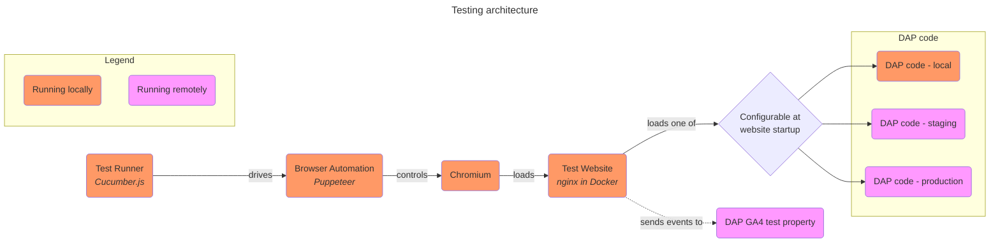
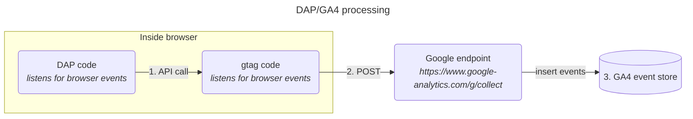

# DAP automated testing docs

The automated tests for the DAP code are implemented using [cucumber-js](https://github.com/cucumber/cucumber-js)
and [puppeteer](https://pptr.dev/).



## Running the test site
The test site is a simple nginx server running in a Docker container. It serves static HTML pages that include the DAP code, allowing us to test the DAP code's behavior in a realistic environment.

To start up the test site, run one of the `test-site-*` commands:

```bash
npm run test-site-dev
```
This particular command will start up the test site at http://localhost:8080/. All pages will be configured to use your local version of the DAP code by including the script tag:

```angular2html
<script async id="_fed_an_ua_tag" src="Universal-Federated-Analytics-Min.js"></script>
```

You can also choose to run the test site configured to load a deployed version of the DAP code, either the staging or production version, by running `npm run test-site-stg` or `npm run test-site-prd`, respectively.

## Configuring DAP in the test site
The DAP code is configurable at load time via query parameters. For instance, to enable DAP's YouTube tracking, a website
can load the DAP code with the `yt` query parameter set to `true`.

```angular2html
<script async type="text/javascript" id="_fed_an_ua_tag" src="https://dap.digitalgov.gov/Universal-Federated-Analytics-Min.js?agency=HHS&yt=true"></script>
```

The full list of configurable options is available in the [DAP Code Capabilities Summary](https://github.com/digital-analytics-program/gov-wide-code/wiki/DAP-Code-Capabilities-Summary).

The test site is designed to pass through query parameters to the DAP code, allowing you to test different DAP configurations by changing the URL. 
For instance, opening http://localhost:8080/youtube.html?yt=true&search=nasa will load the page for testing DAP's YouTube tracking with YouTube tracking enbabled.
Any query parameters that don't match one of DAP's configuration options will be treated as a normal query parameter (e.g. `search=nasa`).

This capability is used extensively in the automated tests to check the DAP code's behavior in various configurations.

## Running the tests

Start up the test site using any of the `test-site-*` commands:

```bash
npm run test-site-dev
```

Then run the tests against the test site:

```bash
npm run cucumber
```

### Running the tests with a debugger attached

```bash
npm run cucumber:debug
```

### Running the tests and generating a nicely formatted test report

```bash
npm run cucumber:report
```

Test report should be available in `output/test-results.html`.

### Running the tests in verbose mode

Verbose mode logs events that occur within the browser during test execution. If you find yourself wishing that you could
watch what's happening in browser devtools during test execution, try verbose mode:

```bash
VERBOSE=true npm run cucumber
```

## Testing approach
Here's a high-level overview of how browser activity is turned into analytics events by DAP and GA4. Google owns everything in this diagram except for the "DAP code" box:


The basic testing strategy is to insert a test probe at one or more of the numbered points in the diagram and then confirm what the probe
sees once we generate some browser events. Which probe(s) should we use?
1. API call: gtag offers an official, [documented](https://developers.google.com/tag-platform/gtagjs/reference) Javascript API. As such,
we can run tests against a mocked version of the API and, assuming we correctly understand how the API works, have some confidence that passing tests ensure correct behavior.
These tests will be fast and fairly reliable (Puppeteer will always introduce some flakiness).
2. POST: Google Analytics does not treat the `collect` endpoint as a public API. It is not officially documented, both in terms of the structure of the requests to it and
in terms of what triggers those requests. It is true that many developer plugins/extensions have been built to interpret these requests but it would
be risky to build our test suite on top of reverse-engineered knowledge of an unofficial API. Tests would need a plugin of this type that was officially released by Google.
3. GA4 event store: For e2e tests, we could use the Google Analytics Data API to query for GA4 events that we expected to be received during the test run.

The current test suite only uses probe 1. Since the gtag API documentation is actually not very thorough, we should probably add some
integration-type tests that use probes 2 and/or 3 to confirm that our understanding of the API is correct and that the events we expect to be generated are actually being received by Google Analytics.


 


